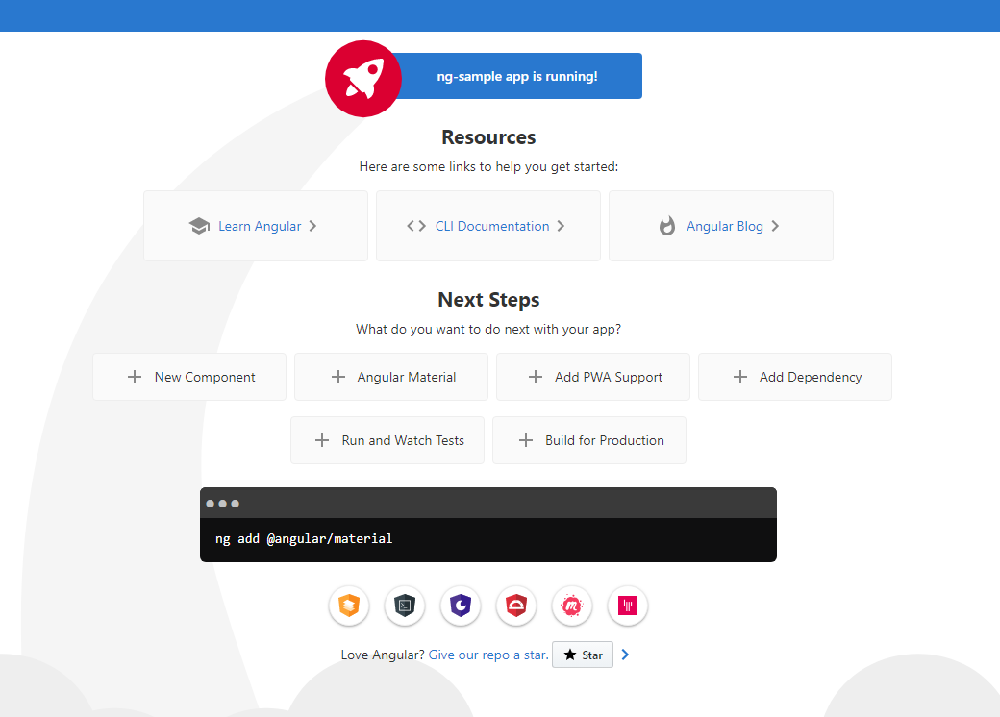
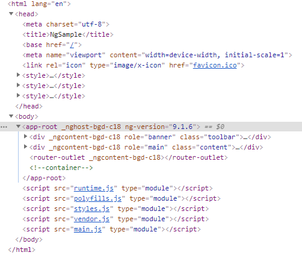
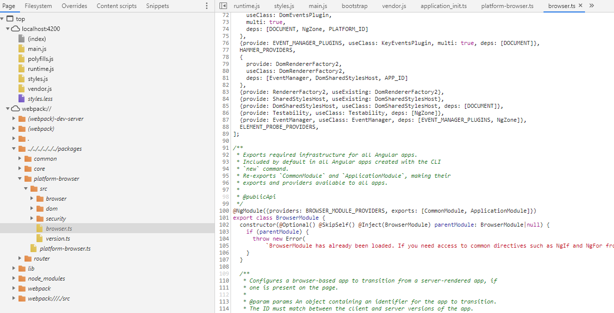

# Understanding Angular
Find something in Angular each day. Keep curious about what you use in developing and you will learn something new.


## 2020/05/12

### 基本环境
安装最新版的angular-cli，在空目录下运行：
```shell
npm install -g @angular/cli
```
安装版本为：
```shell
@angular/cli@9.1.5
```
新建一个Angular app，如：
```shell
ng new ng-sample
```
创建期间我选择了同时安装`angular-router`模块，以及使用`Less`作为CSS工具。然后运行`npm install`安装依赖的package。我安装的angular版本是`9.1.6`，下面的学习就以这版本为准。运行`ng serve`即可启动Angular的示例程序。



### 问题一： index.html里的脚本是哪里来的？



[这里](https://stackoverflow.com/questions/48942691/how-angular-builds-and-runs) 有一个参考答案

在这些文件里，runtime.js和vendor.js来自webpack的配置，而webpack是Angular CLI的内置打包工具。main.js是程序的入口，polytill.js处理一些兼容性的依赖包，styles.js是webpack加载和生成样式的代码。在`angular.json`里面可以找到相应的配置。

### 问题二：如何加载并调试Angular的Typscript源代码？
现代浏览器都支持source map功能，可以同时加载编译好的JS和原始的TS代码。对于Angular CLI来说，可以在build配置里添加source map的支持：
```json
...
"serve": {
    "builder": "@angular-devkit/build-angular:dev-server",
    "options": {
        "browserTarget": "ng-sample:build",
        "sourceMap": {
            "scripts": true,
            "styles": true,
            "vendor": true
        }
    },
    "configurations": {
        "production": {
            "browserTarget": "ng-sample:build:production"
        }
    }
},
...
```
这样在`ng serve`后可以在浏览器的调试工具中通过`Ctrl+P`来访问某个源文件（比如与Angular Core 模块对应的`core.ts`）。这些源文件中可以加断点用于调试。


